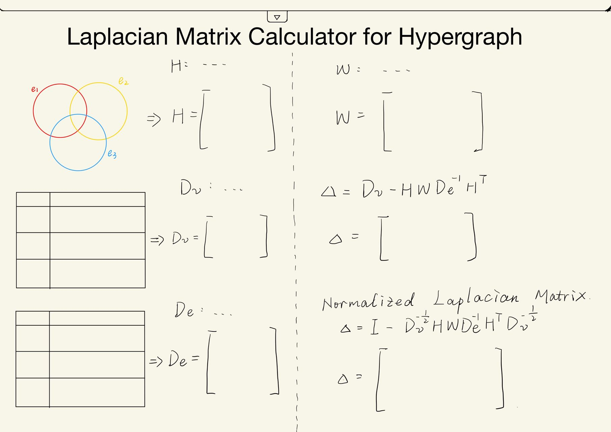
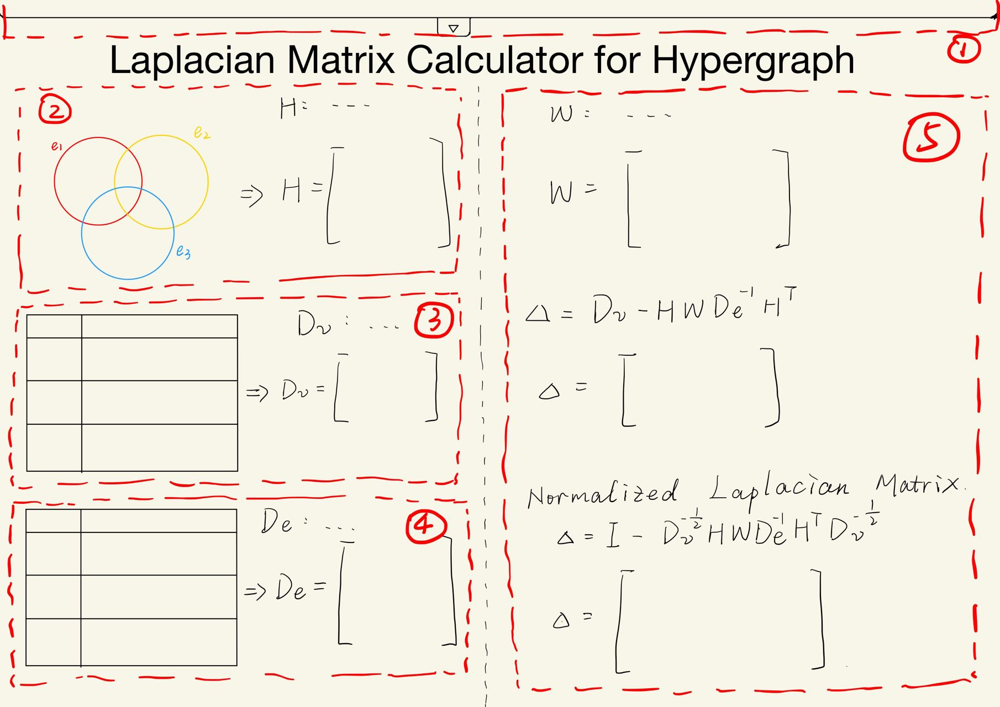
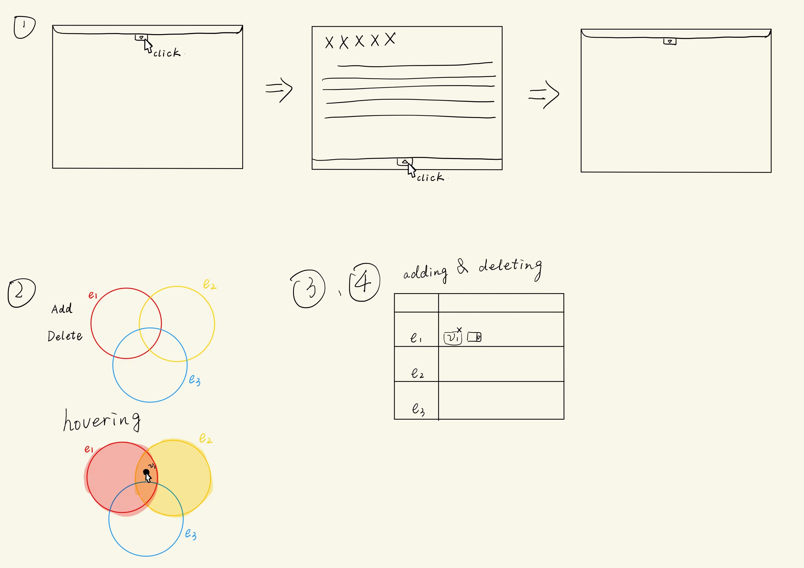
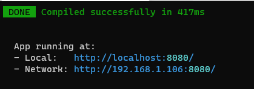
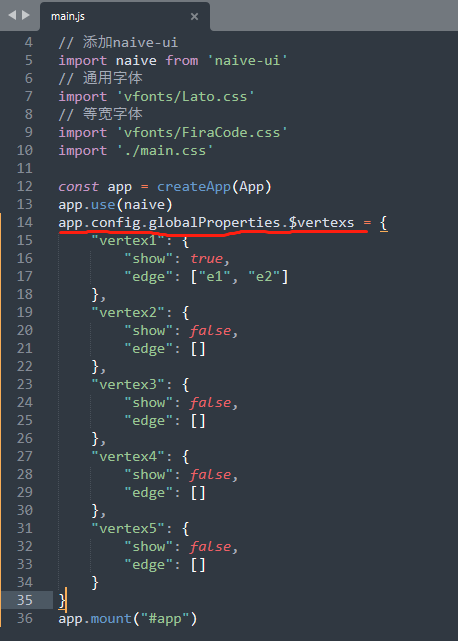
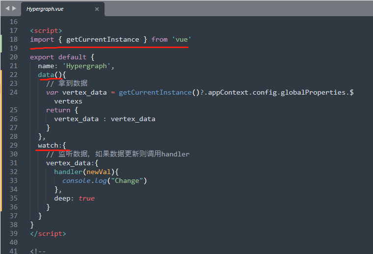

# README

**数据可视化课程期中project**

## Laplacian Matrix Calculator for Hypergraph设计

Laplacian Matrix Calculator for Hypergraph可视化超图的拉普拉斯矩阵计算过程。

### 页面草图



### 各个部分交互等细节说明





1. 一个下拉框，点击下三角可以向下拓展出一个页面，点击上三角可以再次隐藏页面。拓展的页面用于介绍拉普拉斯矩阵。
2. 能够增加减少点，拖动点可以改变点的位置。当鼠标拖着点到超边上时，对应超边内部颜色填充。
3. 增加或者删除元素
4. 同上
5. 如果超图的状态发生改变，那么计算结果都需要发生改变

### 技术难点

- 超图和表格的联动可能要设计一下数据格式这些。一个想法：

```json
{
	"vertex1": {
		"show": true,
		"edge": ["e1", "e2"]
	},
	"vertex2": {
		"show": false,
		"edge": []
	}
}
```

- 得找一下计算矩阵的javascript的库
- 各种界面上的交互设计需要看看Bootstrap上能不能实现，不能实现还需要改方案（主要是表格还有那个下拉设计）。

### 分工

- 页面整体框架划分 徐沁玫
- 超图绘制（改变超图->改变数据结构）徐沁玫
- 两个表格绘制（交互->改变数据结构）张炜晨
- 下拉框的内容撰写以及文字的html排版  周天立
- 矩阵计算以及根据数据改变重新计算 石大川
- 矩阵计算模块html排版 史伊凡
- 制作ppt准备pre  王思曼

## 实现细节

各种权衡之后还是选择使用Vue来搭建网页。UI使用Naive UI。

### 环境安装

Vue.js官网：https://cn.vuejs.org/index.html

Node.js官网：https://nodejs.org/zh-cn/

Naive UI官网：https://www.naiveui.com/zh-CN/os-theme

D3.js官网：https://d3js.org/

Element UI： https://element-plus.gitee.io/zh-CN/guide/installation.html#%E7%89%88%E6%9C%AC

#### npm安装

首先需要安装npm，可以查一下Node.js怎么安装，通过安装node.js使用node.js自带的npm即可。

#### Vue安装

按照Vue官网要求使用npm安装即可。**注意要安装Vue3.x的版本！！！**

#### Naive UI安装(这个好像不用再单独输入一遍了，可以看看能不能跟着开发项目里的步骤打开项目)

按照Naive UI给出命令使用npm安装即可。

#### D3安装(这个好像不用再单独输入一遍了，可以看看能不能跟着开发项目里的步骤打开项目)

按照D3给出命令使用npm安装即可。

#### 如果你是用sublime写代码

因为项目要写vue文件，但是sublime可能不会给vue文件高亮，可以参考https://www.cnblogs.com/echoppy/p/9837526.html配置。

### 开发项目

项目使用vue-cli创建的（我图省事），在win11系统下执行如下步骤即可进行开发和查看效果（其他系统应该不会差很多）：

1. 在hypergraph目录下打开终端

2. 在命令行输入npm run serve然后回车（根据hypergraph目录下的README.md，可能初次要先npm install然后再npm run serve。可以先run serve试一下，不行的话再install一下）

3. 稍等一会儿能看到命令行里给了url，把url输入进浏览器回车就可以看到网页了

   

   **命令行要一直开着，不要Compiled success之后就把命令行关了。要是要看网页就需要一直开着命令行。另外就是改代码保存后会立即重新Compile，如果有错的话会在命令行里面报错，所以记得check命令行的Compile结果。**

**components文件夹里有五个vue文件，每个vue文件开头我都写了谁会需要编辑这个vue文件，根据注释改就行了**

### 关于Vue.js

虽然我们这个写的文件从html文件变成了vue文件，但是如果你打开看vue文件可以发现它基本上长得还是跟普通html差不太多。希望大家能顺顺利利进行开发，在b站上找到一个简短的说明视频，希望可以帮助大家迅速理解vue的基础逻辑：https://b23.tv/qhI7gqg，如果有问题我们在群里再聊。

### 数据更新与共享（超图绘制、表格绘制以及矩阵计算三部分可能会用到）

#### 数据结构

目前的数据结构如下：

```json
{
	vertex1: {
		show: true,
		edge: ["e1"]
	},
	vertex2: {
		show: true,
		edge: ["e2"]
	},
	vertex3: {
		show: true,
		edge: ["e3"]
	},
	vertex4: {
		show: false,
		edge: []
	},
	vertex5: {
		show: false,
		edge: []
	}
}
```

show代表这个点有没有在图中出现。edge是一个集合，代表

#### 

考虑到不想把事情做复杂，目前没有写任何后端，纯前端完成。

为了各自编程方便，现在超图绘制、表格绘制以及矩阵计算三部分我分成了四个独立的组件（超图绘制1个，表格绘制2个，矩阵计算1个）（组件可以直接粗暴理解为互相独立的分块）。由于超图和表格都涉及到修改超图数据，而四个组件都需要在超图数据发生变化后进行更新，因此需要让四个独立组件能共享数据以及在数据发生变化后进行响应（包括组件内改变以及响应别的组件改变数据）。目前我的方案是：

在main.js中定义一个全局变量$vertexs：



在四个组件对应的vue文件里，获取并监听这个全局变量（以超图的为例，其他三个我没写），当数据发生变化后会调用handler函数：



对于超图和表格绘制来说，handler里直接进行超图和表格的“被动更新”即可（但似乎会造成调用watch两次？）。如果会造成调用watch两次其实可以在data()里多增一个bool变量change，用来标记是不是自己组件发起的变化就行了。

对于矩阵计算而言并不需要主动去改数据，可以去研究一下vue3.x教程开头那些内容，看看能不能直接在handler里改变data()值然后vue直接改变页面上的显示。

**上面的方法只是解决了数据发生改变时如何更新页面，至于如何初始化页面，应该用data()+< template >最多再加一个mounted函数就够了**

### 超图绘制实现思路&细节

超图绘制可分成两部分：超边的绘制和交互+点的绘制和交互

#### 超边的绘制

​        根据设计稿，三个超边互相之间会有重叠。在d3中使用circle画圆后三个圆圈势必会互相遮挡导致不能直接监听mouseon和mouseleave来实现悬停变色的功能（比如边2比边1后画，那么边2就会遮挡住边1，鼠标如果在边1和边2重叠区域里mouseon就监听不到鼠标在边1里，导致边1不会变色）。所幸如果精心设计代表三个超边的圆的摆放位置，它们的交点是非常容易计算出来的，于是可以利用交点的信息使用path来绘制7个区域，这7个区域相互之间不会遮挡，当鼠标悬停在不同区域调用不同函数让对应超边变色。

### 拉普拉斯矩阵的直观含义
通过举例解释拉普拉斯矩阵在图论中的含义和作用，使用html排版，类似幻灯片形式


## 更新日志
2022.04.18 syf 完成了矩阵输出模块排版配色

2022.04.17 sdc 完成了矩阵换行

2022.04.17 syf 完成了矩阵运算输出转拼接换行字符串和矩阵排版

2022.04.15 sdc 完成了矩阵运算以及根据数据改变重新计算

2022.04.14 zwc 两个表格与超图的互动已经基本完成

2022.04.13 May 把点表加到网页里了，边表应该照葫芦画瓢就行了

2022.04.09 Avengerszhi 完成对拉普拉斯在普通图到超图作用的解释（通过一个直观的小例子解释）

2022.04.09 May 动画bug解决，超图绘制部分完成

2022.04.07 zwc

```
1.初步完成了两个矩阵（超边矩阵和顶点矩阵）之间联动，可以通过矩阵可视化的对超图结构的超边/顶点进行增减，然后因为超图绘制固定了超边和顶点的最大数目，这里也直接固定了，其中可选顶点有{v1,v2,v3,v4,v5}；可选超边有{e1,e2,e3} 详情可见table文件夹
2.矩阵绘制部分使用的是Element UI
3.基本功能是都完成了，里面存在一些鲁棒性的BUG，比如1.不能判断是否已经存在该超边;2.超边图为超边增加顶点的时候无法直接enter增加，需要将光标移出input框
4.之后需要和超图绘制联动一下数据
5.直接用引入vue包完成的，不用安装环境也可以先看看效果～
```

2022.04.07 May 动画效果还有点问题，其他都完成了【吧

2022.04.06 May 超图点绘制和交互基本完成，还剩更新超图+增删点功能。

2022.04.05 May 超边绘制及交互完成

2022.04.04 May 框架初步完成，自适应是个问题还需要继续解决

### 项目报告

见 [PPT](./Laplacian%20Matrix%20Calculator%20for%20Hypergraph.pptx).
